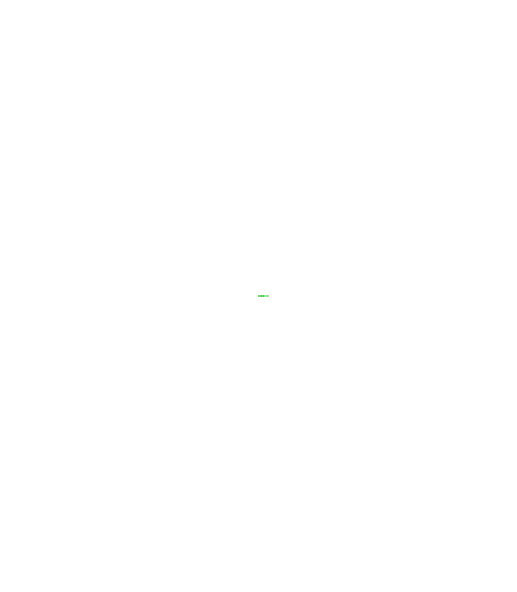
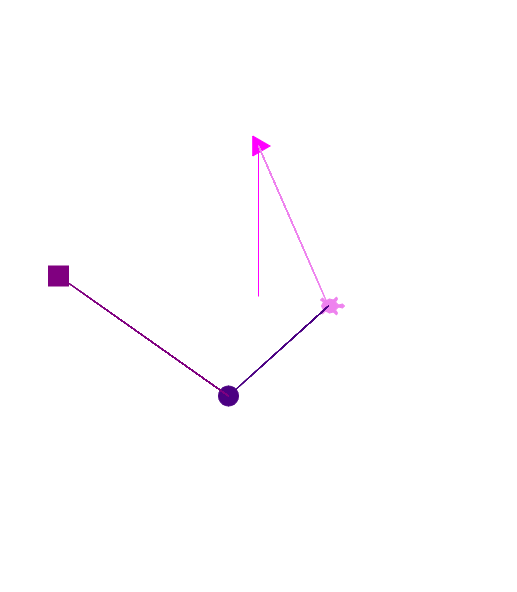

# Week 3
## The Turtle Module
To get started with this lesson, please visit [this site](http://www.pythonsandbox.com/turtle)

If you open this page, you will see this code already typed in the window.

```python
import turtle
t = turtle.Turtle()
t.speed(5) # 1:slowest, 3:slow, 5:normal, 10:fast, 0:fastest
t.forward(100)
```
When you run this program with the play button, the result looks like this.


In the above code, *turtle* is a module, or package (more on that later) and *Turtle()* is a class. Object-oriented programming is mainly focused on classes, which contain attributes (variables) and methods (functions). The variable *t*, meanwhile, is an instance of a class.

In the case of the Turtle() class, these attributes are set using certain methods, such as *speed()* to set the speed of the turtle. 

**Other functions that set attributes for Turtle()**

**.color()-** sets the colour of both the turtle and its pen
```python
import turtle
t = turtle.Turtle()
t.color("lime green")
t.forward(10)
```


**.pencolor()-** sets the colour of just the turtle's pen
```python
import turtle
t = turtle.Turtle()
t.pencolor("lime green")
t.forward(10)
```


**.fillcolor()-** sets the colour of the filled area of what is drawn
```python
import turtle
t = turtle.Turtle()
t.fillcolor("lime green")
t.forward(10)
```


*For these above functions, the argument can either be the name of the colour, its hex code or a tuple of its RGB value, but we'll just work with [official colour names](https://trinket.io/docs/colors) to keep things simple.*

**.setx() / .sety()-** sets the x-coordinate/y-coordinate of the canvas that the turtle is on
```python
import turtle
t = turtle.Turtle()
t.setx(100)
t.sety(100)
```


**.shape()-** sets the shape of the turtle (not the shape it's drawing)


**.up() / .down() [also known as .penup() / .pendown()]-** controls whether the turtle's pen is up (off) or down (on)
```python
import turtle
t = turtle.Turtle()
t.up() # pen is off
t.forward(50)
t.down() # pen is on
t.forward(50)
```


**.width() [also known as .pensize()] -** sets the line thickness of the pen
```python
import turtle
t = turtle.Turtle()
t.width(5)
t.forward(30)
t.width(10)
t.forward(30)
t.width(25)
t.forward(30)
t.width(50)
t.forward(30)
t.width(75)
t.forward(30)
```


**.seth() [also known as .setheading()]-** sets the angle (in degrees) that the turtle is headed in (counterclockwise)
```python
import turtle
t = turtle.Turtle()
t.forward(50)
t.seth(45)
t.forward(50)
```


Then, there are other methods, which control the movement of the turtle; for instance, *forward()*, which allows the turtle to move up a certain amount of steps.

**.backward()-** allows the turtle to move down a certain amount of steps
```python
import turtle
t = turtle.Turtle()
t.backward(100)
```


**.right() / .left()-** turns the turtle clockwise/counter-clockwise a certain number of degrees (although, I think .seth() is a good alternative)
```python
import turtle
t = turtle.Turtle()
t.forward(50)
t.right(90) # turn 90 clockwise
t.forward(40)
t.left(90) # turn 90 counter-clockwise
t.forward(40)
```


**.goto() [also known as .setpos() or .setposition()]-** moves the turtle to a certain coordinate of its canvas (a better alternative to .setx() and .sety())
```python
import turtle
t = turtle.Turtle()
t.up()
t.goto(100,50)
t.down()
t.forward(60)
```


**.dot()-** draws a dot on canvas of a given size and colour
```python
import turtle
t = turtle.Turtle()
t.dot(30)
```


**.circle()-** draws a circle on canvas, given its radius, making life so much easier
```python
import turtle
t = turtle.Turtle()
t.circle(30)
```


**.stamp()-** stamps a copy of the turtle's shape to canvas
```python
import turtle

t = turtle.Turtle() 

t.color("magenta")
t.shape("triangle")
t.goto(0, 150)
t.stamp()

t.color("violet")
t.shape("turtle")
t.goto(70,-10)
t.stamp()

t.color("indigo")
t.shape("circle")
t.goto(-30, -100)
t.stamp()

t.color("purple")
t.shape("square")
t.goto(-200, 20)
t.stamp()
```


If you're interested in the full documentation for the turtle module, click [here](https://docs.python.org/3/library/turtle.html).

**Your Turn!** Using as many of the methods mentioned above as you can, try creating your own cool shape with Python's turtle module. Be creative and I can't wait to see your canvases next week!

But before you get started... 

Did you know that you can make *more than one* turtle?

Here's an example:
```python
import turtle

# initialize turtles
t1 = turtle.Turtle()
t2 = turtle.Turtle()

# set pen colour
t1.pencolor("teal")
t2.pencolor("crimson")

# set fill colour
t1.fillcolor("dark turquoise")
t2.fillcolor("red")

# set thickness
t1.width(5)
t2.width(10)

# set shape of turtle
t1.shape("classic")
t2.shape("turtle")

# set positions
t1.up()
t1.goto(-150,0)
t1.down()

t2.up()
t2.goto(150,0)
t2.down()

# t1 draws a rhombus of side length 100
t1.begin_fill()
t1.seth(45)
t1.forward(100)
t1.right(90)
t1.forward(100)
t1.right(90)
t1.forward(100)
t1.right(90)
t1.forward(100)

# t2 draws a circle of radius of 60
t2.begin_fill()
t2.circle(60)

# shapes filled
t1.end_fill()
t2.end_fill()
```


**And one more thing!**

We discuss more about loops a little later, but it's important that you know about the *for loop*, in case your Turtle Project involves some repetition.

Here's an example of the for loop using the turtle module.

```python
import turtle

t = turtle.Turtle()
t.speed(0) 

for i in range(100): # it's a spiral!
  t.forward(4 * i)
  t.right(90)

t.forward(400)
```


## Packages
As mentioned earlier, the *turtle* module is a package. Packages contain specialized classes and modules, and there are thousands available for all Python developers through the Internet. 

The *import* statement lets the compiler know that a certain package's content is being used for your code.
```python
import package_name_goes_here
```
Actually, try *this* one!
```python
import this
```
Python has its own built-in packages, so it's best to start learning about packages using one.

Enter the *random* module!

The random module is a standard for developers, providing a framework to generate random numbers and integers. Whenever I or any Python programmer needs some **randomness** for their code, this package is the go-to!

Here are some methods that come in handy when using this package:

**.random()-** generates a float between 0 and 1

**.randint()-** generates an integer between two integers

**.shuffle()-** scrambles a sequence in its place

If you're interested in more methods from this module's documentation, click [here](https://docs.python.org/3/library/random.html).

Here's a simple example using the random module: rolling a die!
```python
import random

sides = int(input("How many sides? "))
diceNum = random.randint(1,sides)
print("A " + str(diceNum) + " was rolled!")
```
**Your Turn!** Try making a program that uses the random module, as well as some of the material we've covered so far.

Here are some of Python's other built-in modules:

[**math-** contains mathematical values and functions](https://docs.python.org/3/library/math.html)

[**time-** contains time-related attributes and conversions](https://docs.python.org/3/library/time.html)

[**os-** contains operating system interfaces, most commonly used to open and read files](https://docs.python.org/3/library/os.html)

## Errors

When running Python code, there are three types of errors you will potentially encounter.

**Syntax Errors**

Syntax errors occur if any syntax of an expression isn't constructed properly, and so the compiler will be unable to process it.

For example, this code will return a syntax error:
```python
x = str(6
```
```
SyntaxError: unexpected EOF while parsing
```
This is obviously because the right bracket is missing.

**Runtime Errors**

Runtime errors occur if the program is running and an "illegal" operation is compiled.

For example, division by 0 will result in a ZeroDivision Error, which is a type of Runtime Error. 

Another example is this:
```python
fav_colour = input("What's your favourite colour? ")
print(favColour + " is an interesting colour!")
```
```
NameError: name 'favColour' is not defined
```
**Semantic Errors**

Semantic errors occur when the program runs well, but the output is not the coder's intention.

For instance, say you're creating a program that calculates the perimeter of a triangle. You type this:
```python
sidelength = input("What's the side length of the triangle? ")
print("The triangle's perimeter is " + (sidelength * 3))
```
You get this:
```
What's the side length of the triangle? 6
The triangle's perimeter is 666
```
Although there's no error message, this is still an error, because, well, it's an error. It's definitely not what you wanted to program to spit out.

**Your Turn!** Can you think of some more examples of *runtime* errors? We will share some next week.

## Loops
There are two kinds of loops in Python: *for* and *while*, as well as nested loops.

First, let's revisit the for loop from earlier and break it down.
```python
for i in range(100): 
  t.forward(4 * i)
  t.right(90)
```
Line 1 lets the compiler know that the next bit of code is a for loop, which is the kind of loop in programs that repeats a certain number of times. The *i* is an iterator variable, which keeps track of the number of times the loop is running so far (or at least what value range() is currently on). If not necessary for the actions that the loop is executing, the iterator variable can be represented as a *_*. 

For example...
```python 
for _ in range(5):
	print("Hello!")
```
```
Hello!
Hello!
Hello!
Hello!
Hello!
```
As you can probably infer from the code above the *range()* function determines how many times the code inside the loop will be ran.

Did you know that you can also use a sequence (such as a string or a list) as the basis for a for loop? Here's a simple example.
```python
for char in "Coding Club":
	print(char)
```
```
C
o
d
i
n
g
 
C
l
u
b
```
In the case of the for loop above, *char* is a character of the string "Coding Club". Instead of the range() function is "Coding Club", since it's the scope of the loop's functionality, and it's the sequence to be used. In fact the output of range() is a sequence itself. If you covert a range() function to a list, this will be produced.
```python
print(list(range(6)))
```
```
[0, 1, 2, 3, 4, 5]
```
**Note:** Seeing this list starts with 0 instead of 1, I should inform you Python is one of the many languages that uses *zero-based indexing*. Put simply, the *index* or position number of the first element of a sequence is always 0 instead of 1, so the length of a sequence is equal to one more than the index of the last element of that sequence.

**The while loop**

The other kind of loop is the while loop, which, unlike the for loop, runs until a certain condition is false (we won't learn about conditionals until a little later on, but that's a different story). Because of this, some while loops can go on forever and return a runtime error. Here's a simple example.
```python
i = 0
j = 0
while i < 30:
    j+=1
    i+=j
    print(i)
```
```
1
3
6
10
15
21
28
36
```
By the way, that *i < 30*? This means i, the number printed out, will keep on being added to as long as it's *currently* less than 30. It i equals or is greater than 30, the loop will stop.

**Nested Loops**

These are basically loops within loops. Any type of loop can be put in any type of loop (for in for, while in while, for in while, while in for), but I'll just use a for loop within a for loop to keep things simple.
```python
x = ""
for i in range(5):
    for j in range(10):
        x = x + str(i + j + 1) + " " # add number to string
    print(x) # print line
    x = "" # clear string
```
```
1 2 3 4 5 6 7 8 9 10 
2 3 4 5 6 7 8 9 10 11 
3 4 5 6 7 8 9 10 11 12 
4 5 6 7 8 9 10 11 12 13 
5 6 7 8 9 10 11 12 13 14
```
**Your Turn!** Create a program that uses one or more kind of loop. (Bonus if you use anything we haven't learned yet!)

## Incremental Programming
A good practice to have as a coder is to *test your code often*. What is meant by this is that you run your code at least every time you type a line. Although one might be tempted to write many lines of code before the first time you run it (I know I do), it's a good way to understand your errors better and catch/solve them faster, otherwise your coding problems will continue to grow dramatically like a snowball rolling down a hill. This is **incremental programming** in a nutshell.

Read more [here](https://www.geeksforgeeks.org/incremental-programming-in-python/).
